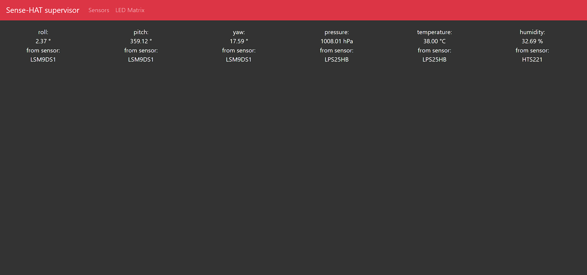
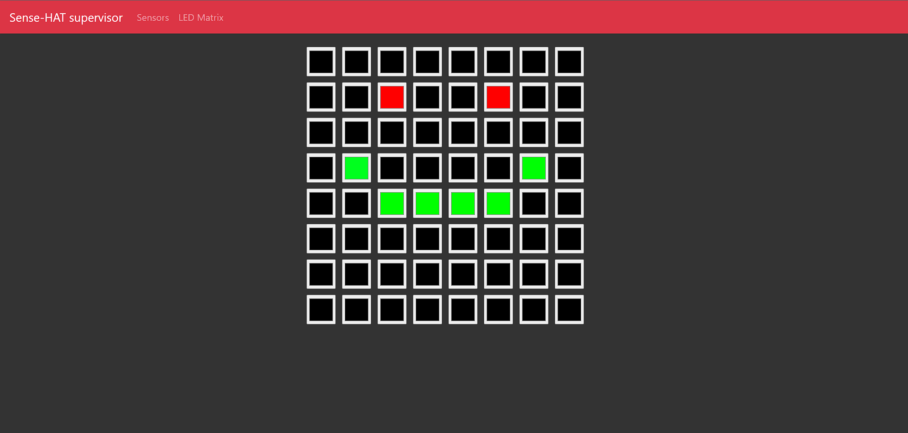
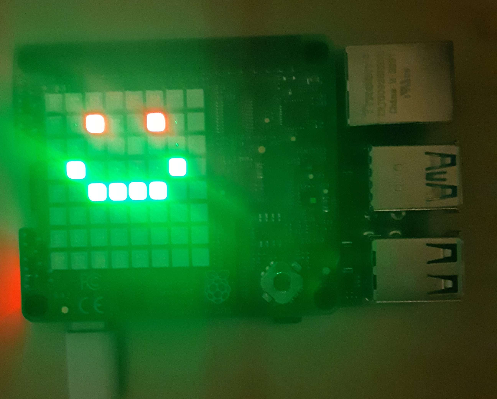

# IoT_RaspberryPi

Prepared with [@dariak153](https://www.github.com/dariak153).

Scripts from 7th semester's course Internet of Things Applications (Aplikacje Internetu Rzeczy).

> [!IMPORTANT] 
> Requires Raspberry PI with Sense-Hat and Raspberry PI must be in the same network as your computer.

> [!NOTE] 
> To start the php server automatically you can add the following line to your crontab ```@reboot sleep 1m && /path_to_at_restart/at_restart/start_php_s``` (make sure to change '/path_to_at_restart/' to real path)

## Final effect

Final effect is a website that is a supervisor of the system. It displays values from sensors such as:
- temperature,
- humidity,
- pressure,
- orientation.



In second tab user can set color of each LED on the LED Matrix of the Sense-HAT.


